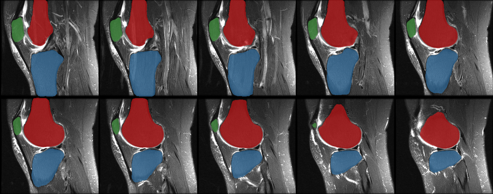

# LabelMore
An easy iterative segmentation tool for MRI data based on [UNet](https://arxiv.org/abs/1505.04597).

You only need to label a small portion of the MRI dataset to segment the rest part.

If the segmentation results are not satisfactory, just **Label** a little bit **More** on top of that.

## Performance
Segmentations of MRNet after 2 iterations (labeled 10 subjects + refined 10 subjects):


## Installation
This code requires PyTorch 1.1+.

Clone this repo and install the dependencies by
```bash
git clone https://github.com/zixuzhuang/LabelMore.git
cd LabelMore
pip install -r requirements.txt
```

## Usage
### 0. Data preparation
The original MRI files need to be put in `data/images` and the segmentation files in `data/segmentations`. The MRI and segmentation files of the same subject must have the same name.

At least 10 initial segmentations are recommended.

### 1. Convert the MRI file to .npz file
```bash
python nii2npz.py
```

### 2. Train the UNet for the first round
```bash
python train.py -c <config-file>
```
The parameters of the training process can be referenced in `configs/mrnet.yaml`.

The corresponding experiment log and model file can be found in `results` after training.

### 3. Evaluate the segmentation result

```bash
python eval.py -m <model-path> -n <evaluate-number>
```

This step will produce a pre-segmentation of the `n` unsegmented MRI files in `data/predictions`. 

To get the segmentation result for all remaining files, set `n` to 0.

### 4. Improve the segmentation performance by labeling more
If you check the pre-segmentation results and are not satisfied with the performance, you just need to refine the pre-segmentation in `data/predictions` and save them in `data/segmentations`. Repeat step 1 to step 4 until the pre-segmentation results meet your needs.
```bash
python nii2npz.py
python train.py -c <config-file>
python eval.py -m <model-path> -n <evaluate-number>
```

When the pre-segmentation results meet your needs, just
```bash
python eval.py -m <model-path> -n 0
```

## Acknowledgments
- Thank [Kai Xuan](https://github.com/woxuankai) for his efficient code bases.